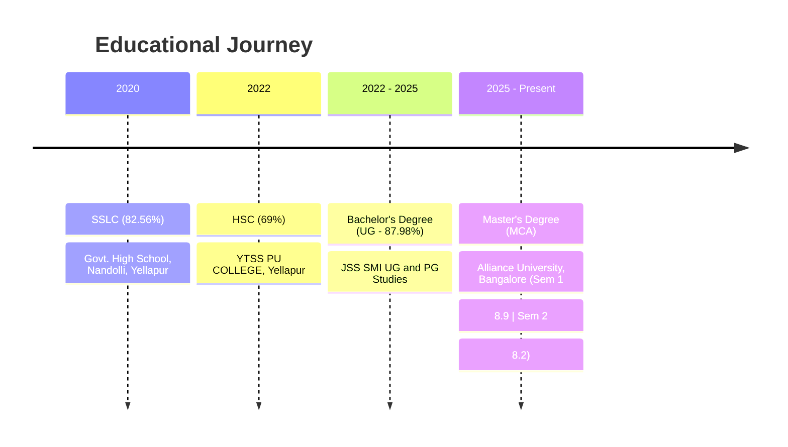

  <!-- Header Banner / Animated Greeting -->
  

   

  <!-- Quick Social Badges -->
  
  
  
  
  

    

  <!-- Dynamic Typing Subtitle -->
  

## 💫 About Me

Graduate student pursuing **Master's Degree (MCA)** at **Alliance University, Bangalore** with a strong foundation in **Computer Applications & Software Engineering**. Passionate about crafting high-performance, real-time web platforms, clean user experiences, and exploring data-driven AI solutions.

- 🎓 **Post Graduation**: Master's Degree (MCA) @ Alliance University, Bangalore *(Sem 1 SGPA: 8.9 | Sem 2 SGPA: 8.2)*
- 🎓 **Under Graduation**: Bachelor's Degree (UG) @ JSS SMI UG & PG Studies *(87.98% Marks)*
- 🛠️ **Core Focus**: Full-Stack Development (React, Node.js, Spring Boot, Flask), Database Management, Machine Learning & Algorithms.
- 📫 **Contact Me**: `gurugbhat27@gmail.com` | `ggurudattaMCA25@stu.alliance.edu.in`

 

---

## 🛠️ Tech Stack & Skills

### 💻 Programming Languages

  
  
  
  

### 🌐 Web & Backend Frameworks

  
  
  
  
  
  
  

### 🛢️ Databases & Storage

  
  
  

### 🔧 Tools, IDEs & AI Development Assistants

  
  
  
  
  
  

 

---

## ⚡ Dynamic GitHub Showcase (Auto-Updating)

<!-- Dynamic Pinned Repositories: Automatically fetches real-time stats (stars, forks, tech stack) from your GitHub account -->

  <table align="center" border="0" cellspacing="0" cellpadding="0">
    <tr>
      <td>
        
      </td>
      <td>
        
      </td>
    </tr>
    <tr>
      <td>
        
      </td>
      <td>
        
      </td>
    </tr>
  </table>

   

  

 

---

## 🎓 Academic Timeline

 

---

## 📊 GitHub Analytics & Real-Time Activity

  <table align="center" border="0" cellspacing="0" cellpadding="0">
    <tr>
      <td>
        
      </td>
      <td>
        
      </td>
    </tr>
  </table>

   

  <!-- Live Contribution Streak -->
  

    

  <!-- Dynamic Activity Graph -->
  

 

---

## 🤝 Connect with Me

  
  
  
  
  

    
  
  Designed with ❤️ for <b>Gurudatta Ganapati Bhat</b>

